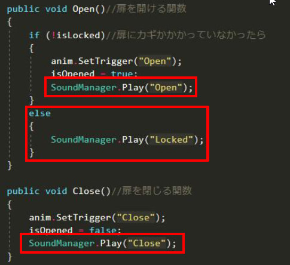
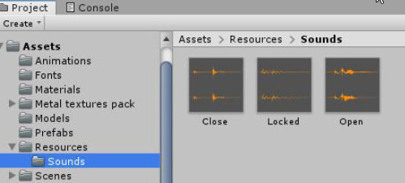

# Unity_Sound_Utility

simple sound play utility for unity   
シンプルなUnity向けサウンド再生ユーティリティ

## Description
Import audio source flies into "Assets/Resources/Sounds" of Unity project,  
and you can play sound from anywhere by just call "SoundManager.Play("audio source flie name")"  
It is possible to play multiple sound sources at the same time.  

Unityプロジェクトの「Assets/Resources/Sounds」フォルダ内に音源ファイルを入れて，
「SoundManager.Play("音源名")」と記述するだけでどこからでも音源を再生可能．  
複数音源の重複再生も可能．  

<b>SoundManager.Play("audio source flie name")</b>  

<b>Import audio source flies into "Assets/Resources/Sounds"</b>  

## Requirement

Unity (2018 above recommended)

## Licence

[MIT](https://github.com/taiga-n/Unity_Sound_Utility/blob/master/LICENSE)

## Author

[taiga-n](https://github.com/taiga-n)
